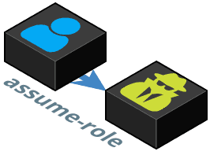

# DEPRECATED - assume-role
This repository is no longer maintained.



Assume IAM roles through an **AWS Bastion** account with **MFA** or **SAML Provider**  via the command line.

**AWS Bastion** accounts store only IAM users providing a central, isolated account to manage their credentials and access. Trusting AWS accounts create IAM roles that the Bastion users can assume, to allow a single user access to multiple accounts resources. Under this setup, `assume-role` makes it easier to follow the standard security practices of MFA and short lived credentials.

**SAML Providers** allow you to use federated login to assume-role-with-saml. SAML Assertions should be
[formatted as following](https://docs.aws.amazon.com/IAM/latest/UserGuide/id_roles_providers_create_saml_assertions.html)
according to AWS.

## Installation

`assume-role` requires [`jq`](https://stedolan.github.io/jq/) and [`aws`](https://aws.amazon.com/cli/) CLI tools to be installed.

### via Homebrew (macOS)

```bash
brew tap coinbase/assume-role
brew install assume-role
```

You can then upgrade at any time by running:

```bash
brew upgrade assume-role
```

### via Bash (Linux/macOS)

You can install/upgrade assume-role with this command:

```bash
curl https://raw.githubusercontent.com/coinbase/assume-role/master/install-assume-role -O
cat install-assume-role # inspect the script for security
bash ./install-assume-role # install assume-role
```

It will ask for your sudo password if necessary.

## Getting Started

If you are using a bastion setup (the default), make sure that credentials for your AWS bastion account are stored in `~/.aws/credentials`.

Out of the box you can call `assume-role` like:

```bash
eval $(assume-role account-id role mfa-token)
```

If your shell supports bash functions (e.g. zsh) then you can add `source $(which assume-role)` to your `rc` file (e.g. `~/.zshrc`), then you can call `assume-role` like:

```bash
assume-role [account-id] [role] [mfa-token]
```

`assume-role` this method can be used with arguments or interactively like:


### SAML authentication

If you would like to authenticate with your SAML provider using username and password instead, add this to your `.bash_profile` or `.bashrc`:
```
export AWS_ASSUME_ROLE_AUTH_SCHEME=saml # defaults to bastion
export SAML_IDP_ASSERTION_URL="your saml idp assertion url"
export SAML_IDP_NAME="Name of your IdP registerd with AWS"
# This is an example body template.
export SAML_IDP_REQUEST_BODY_TEMPLATE='{"service": "aws", "email": "$saml_user", "password": "$saml_password"}'
```

The URL should serve a POST API that returns a SAML Assertion under the `saml_response` JSON key.

You can specify your JSON body via an envar that uses the `saml_user` and `saml_password` envars. You can specify any body template you want.

Your service should be hosted over SSL since credentials might be sent in the response, depending on your JSON body implementation.
You could hash the password client-side if you wish to do so in the template envar

The script will warn you if you are not serving over SSL.

Once you assume-role, you will be prompted for your SAML credentials (username and password).

If you would like to store your credentials on the filesystem for ease of use, you can create a `~/.saml/credentials` file.

An example of what this looks like is (example syntax; These are *not* real):
```
username = lukeskywalker
password = hunter2
```

### Account Aliasing

You can define aliases to account ids in `~/.aws/accounts` which assume-role can use, e.g.

```json
{
  "default": "123456789012",
  "staging": "123456789012",
  "production": "123456789012"
}
```

With this file, to assume the `read` role in the `production` account:

```bash
assume-role production read
# OR
assume-role 123456789012 read
```

Also, by setting `$AWS_PROFILE_ASSUME_ROLE`, you can define a default profile for `assume-role` if you want to separate concerns between
default accounts for `assume-role` and vanilla `awscli` or simply to have better names than `default`:

```bash
$ export AWS_PROFILE_ASSUME_ROLE="bastion"
$ assume-role production read
```

Moreover, if you are in the need of [longer client-side assume-role sessions](https://aws.amazon.com/about-aws/whats-new/2018/03/longer-role-sessions/) and don't want to [enter your MFA authentication every hour (default)](https://github.com/coinbase/assume-role/issues/19) this one is for you:

```bash
$ export AWS_ROLE_SESSION_TIMEOUT=43200
```

However, be aware that for [chained roles](https://docs.aws.amazon.com/IAM/latest/UserGuide/id_roles_terms-and-concepts.html#iam-term-role-chaining) there's currently a forced **1 hour limit** from AWS. You'll get the following error if you exceed that specific limit:

> DurationSeconds exceeds the 1 hour session limit for roles assumed by role chaining.

You can also override the AWS IAM username which is usually fetched from the AWS IAM get-user api. This might not be allowed in some environments though:
```bash
$ export AWS_USERNAME=my_username
```

## AWS Bastion Account Setup

Here is a simple example of how to set up a **Bastion** AWS account with an id `0987654321098` and a **Production** account with the id `123456789012`.

In the **Production** account create a role called `read`, with the trust relationship:

```json
{
  "Statement": [
    {
      "Effect": "Allow",
      "Principal": {
        "AWS": "arn:aws:iam::0987654321098:root"
      },
      "Action": "sts:AssumeRole",
      "Condition": {
        "Bool": {
          "aws:SecureTransport": "true",
          "aws:MultiFactorAuthPresent": "true"
        },
        "NumericLessThan": {
          "aws:MultiFactorAuthAge": "54000"
        }
      }
    }
  ]
}
```

The conditions `aws:MultiFactorAuthPresent` and `aws:MultiFactorAuthAge` forces the use of temporary credentials secured with MFA.

In the **Bastion** account, create a group called `assume-read` with the policy:

```json
{
  "Statement": [
    {
      "Effect": "Allow",
      "Action": [ "sts:AssumeRole" ],
      "Resource": [ "arn:aws:iam::123456789012:role/read" ],
      "Condition": {
        "Bool": {
          "aws:MultiFactorAuthPresent": "true",
          "aws:SecureTransport": "true"
        },
        "NumericLessThan": {
          "aws:MultiFactorAuthAge": "54000"
        }
      }
    }
  ]
}
```

Attach this group to **Bastion** users that should be able use `read`'s policies in the **Production** account.

You can assume the `read` role in **Production** by running:

```
assume-role 123456789012 read
```

Then entering a MFA token on request.

## SAML Provider setup

The SAML Provider will need to be registered in the same AWS account that you are doing assume-role-with-saml into. If you are dealing with many accounts,
the suggested way to handle this is to have one deployment of your SAML Provider that returns assertions for several accounts/roles using the registered
SAML Provider ARN and the role ARN.

Here is a simple example of how to set up a **SAML Provider** in a **Production** account with the id `123456789012`.

In the **Production** account create a saml provider called `saml-idp`, and a role called `read` with the trust relationship:

```json
{
  "Statement": [
    {
      "Effect": "Allow",
      "Principal": {
        "Federated": "arn:aws:iam::123456789012:saml-provider/saml-idp"
      },
      "Action": "sts:AssumeRoleWithSAML",
      "Condition": {
        "Bool": {
          "aws:SecureTransport": "true",
        },
        "StringEquals": {
          "SAML:aud": "https://signin.aws.amazon.com/saml"
        }
      }
    }
  ]
}
```

And configure your SAML Provider to return signed assertions for the `read` role in the **Production** acount.

## Prompt

If you are using `zsh` you can get a sweet prompt by adding to your `.zshrc` file:

```bash
# AWS ACCOUNT NAME
function aws_account_info {
  [ "$AWS_ACCOUNT_NAME" ] && [ "$AWS_ACCOUNT_ROLE" ] && echo "%F{blue}aws:(%f%F{red}$AWS_ACCOUNT_NAME:$AWS_ACCOUNT_ROLE%f%F{blue})%F$reset_color"
}

# )ofni_tnuocca_swa($ is $(aws_account_info) backwards
PROMPT=`echo $PROMPT | rev | sed 's/ / )ofni_tnuocca_swa($ /'| rev`
```

For `bash` you could put the following in your `.bash_profile` file:

```bash
function aws_account_info {
  [ "$AWS_ACCOUNT_NAME" ] && [ "$AWS_ACCOUNT_ROLE" ] && echo -n "aws:($AWS_ACCOUNT_NAME:$AWS_ACCOUNT_ROLE) "
}

PROMPT_COMMAND='aws_account_info'
```

## Testing

assume-role is tested with [BATS](https://github.com/sstephenson/bats) (Bash Automated Testing System). To run the tests first you will need `bats`, `jq` and `shellcheck` installed. On macOS this can be accomplished with `brew`:

```bash
brew install bats
brew install jq
brew install shellcheck
```

Then run `bats test/assume-role.bats`;
